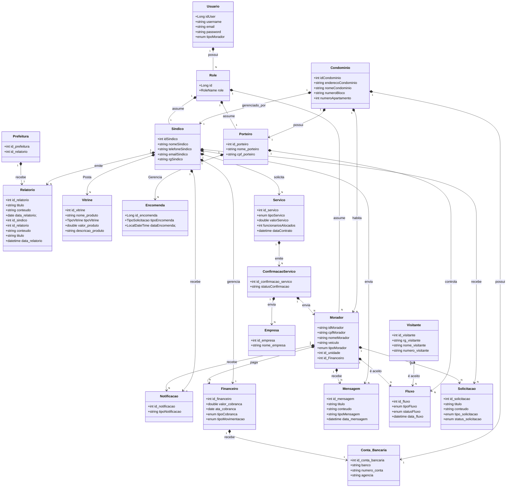

# 🏢 Habita Recife  


## 📊 Visão Geral  

A Plataforma de Gestão Condominial é uma solução abrangente para administração de condomínios, oferecendo ferramentas para gestão de moradores, controle financeiro, comunicação, tarefas administrativas e manutenção.

## 👥 Público-Alvo  

Conjuntos habitacionais da cidade do Recife e seus respectivos síndicos e moradores.  


## ⚙️ Funcionalidades  


#### 👤 Cadastro e gestão de moradores:  

- Cadastro completo de moradores e seus dependentes.
- Histórico e informações de contato.
- Controle de inadimplência.
  

#### 📈 Controle financeiro:  

- Lançamento de receitas e despesas.
- Emissão de relatórios financeiros detalhados.
- Controle de inadimplência, cobrança e multas.
- Arrecadação de taxas condominiais.
  

#### 💬 Comunicação:  

- Canal de comunicação com envio de avisos e comunicados aos moradores.
- Canal de recebimento de reclamações, postagem e divulgação de serviços e reserva de espaços.
- Agendamento de assembleias pelo síndico online e presenciais.
- Vitrine para divulgação de serviços de moradores.
  

#### 🗒️ Tarefas administrativas:  

- Geração de relatórios para prestação de contas.
- Gerenciamento de documentos e contratos.
  

#### ⚖️ Manutenção:  

- Abertura e acompanhamento de solicitações de manutenção.
- Histórico de manutenções realizadas.
  

#### ⛓️ Acesso e Segurança:  

- Histórico de entradas e saídas (moradores e visitantes).
- Cadastro de visitantes e controle de acesso com QR Code.
- Cadastro de moradores e veículos.
  

#### 💳 Outras Funcionalidades:  

- Geração de renda e abatimento de contas para moradores desempregados (parcerias).
- Mercado para anúncios de moradores.
  

  
## 🌐 Arquitetura e Stack  

  
A plataforma é desenvolvida utilizando tecnologias modernas e robustas:
- 🔦 **Frontend**: React, para uma interface responsiva e amigável.
- 🚀 **Backend**: Spring, para uma arquitetura escalável e segura.
- 💾 **Banco de dados**: MySQL, para armazenamento e gerenciamento de dados.
  


## ⚡ Execução do Código  

### 🖥️ Backend - Spring Boot  


Clone o repositório:

bash
```
git clone https://github.com/seu-usuario/seu-repositorio-backend.git
```
Acesse o diretório do projeto:

bash 
```
cd seu-repositorio-backend
```
Configure o banco de dados no application.properties ou application.yml, exemplo:

bash 
```
# Configuração do banco de dados MySQL

spring.datasource.url=jdbc:mysql://localhost:3307/habita_recife_backend?createDatabaseIfNotExist=true&serverTimezone=UTC&useSSL=false&allowPublicKeyRetrieval=true
spring.datasource.username=seu-usuario
spring.datasource.password=sua-senha-mysql
spring.datasource.driver-class-name=com.mysql.cj.jdbc.Driver

# Configuração do Hibernate e JPA
spring.jpa.database-platform=org.hibernate.dialect.MySQL8Dialect
spring.jpa.hibernate.ddl-auto=update
 
```
Compile e execute o projeto:

bash 
```
    mvn spring-boot:run
```

### 🌐 Frontend - React  


Clone o repositório:

bash
```
git clone https://github.com/seu-usuario/seu-repositorio-frontend.git
```
Acesse o diretório do projeto:
bash
```
cd seu-repositorio-frontend
```
Instale as dependências:
bash
```
npm install
```
Configure a conexão com o backend no .env:

bash
```
REACT_APP_API_URL=http://localhost:8080
```
Execute o projeto:

bash
```
    npm start
```
🔗 Acesso
bash
```
	Backend: http://localhost:8080
	Frontend: http://localhost:3001
```

      
## Banco de Dados  

Representação no Mermaid




  
## 📃 Observações  

Este documento está em constante atualização.

